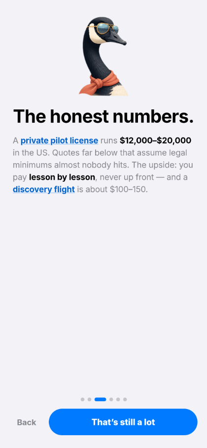
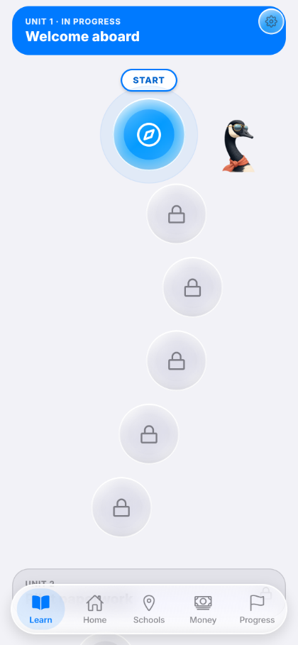
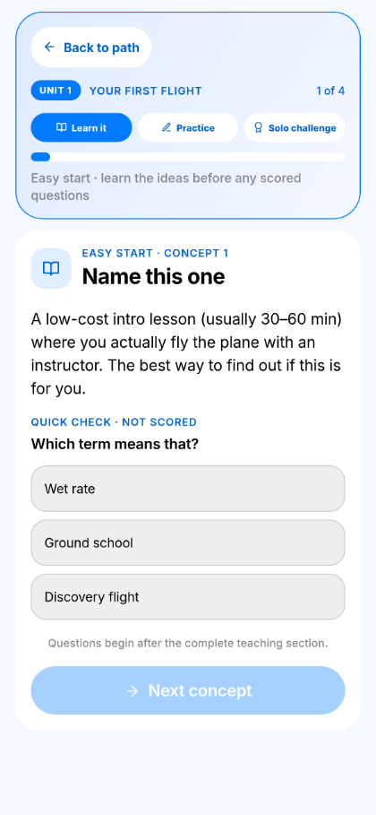
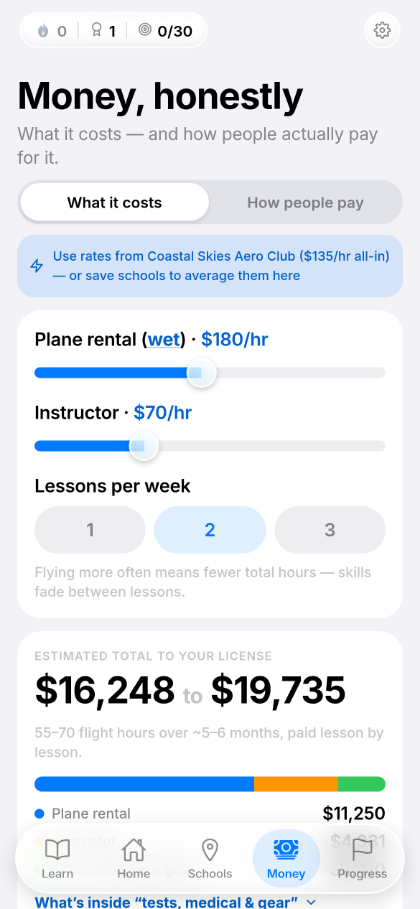
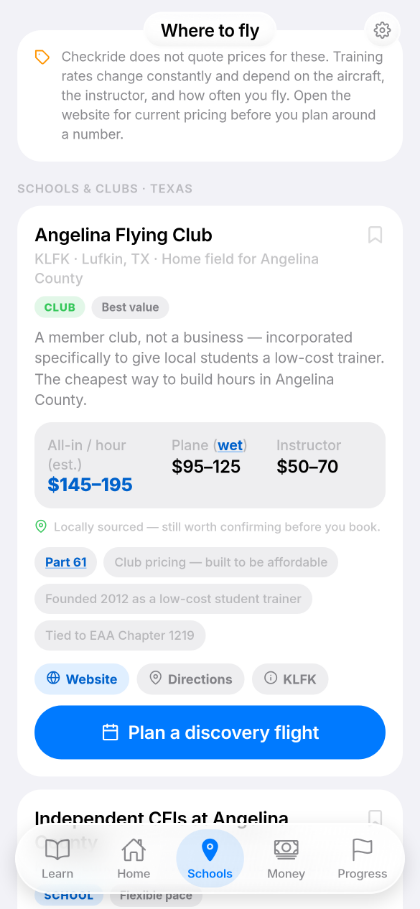
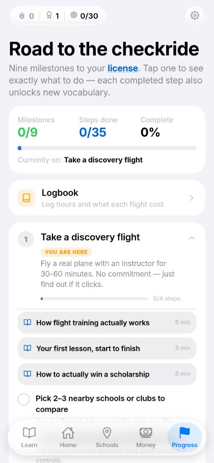

# Checkride

A study platform that takes student pilots from their first lesson to the private pilot
checkride — structured ground school, spaced review, and the planning tools training
actually requires. Built for iOS and Android.

> **This repository is a public overview.** The source is private while the app is prepared
> for App Store release.

## Why

Private pilot training is expensive and badly organised. The knowledge you need is scattered
across the FAR/AIM, a handful of textbooks, and whatever your instructor remembers to cover.
Students pay by the hour, so every lesson spent re-teaching material that should have been
studied on the ground is money spent on the wrong thing.

I earned my own private pilot certificate in January 2024. Checkride is the tool I wanted
while I was doing it.

## What it does

**Ground school as a real curriculum**

- 10 units, 41 lessons, 193 topics
- A 40-question placement test sets the starting point, so a student who already knows
  airspace is not made to sit through it again
- A spaced review scheduler resurfaces topics on an interval that stretches as you answer
  correctly and collapses when you miss
- Oral-prep flashcards aimed at the questions examiners actually ask
- XP and streak tracking, for the days when motivation is thin

**The tools students reach for between lessons**

- Flight school and scholarship search
- Cost planning that projects the real price of a certificate, not the brochure number
- Flight logging against checkride hour minimums
- METAR decoding — raw observation strings turned into plain English
- Weight and balance calculations for the aircraft being flown

**Data handling**

- Local storage, so the app works without a connection
- Backup and restore
- Covered by an automated test suite

## Built with

JavaScript · React Native · Expo · Jest

## Status

In active development. Targeting App Store and Google Play release.

## Screenshots

| | | |
|:---:|:---:|:---:|
|  |  |  |
| **The number, up front** Quotes below $12k assume the 40-hour legal minimum. Most people fly 60–75. | **Ground school with a shape** 41 lessons across 10 units, each unlocking the next. | **Teach first, then test** Learn it → Practice → written-style checkpoint, held until the end. |
|  |  |  |
| **Your number, not a brochure's** Drag the rates, pick how often you fly, watch the total move. | **Real schools and clubs** Estimated all-in rates, with the limits of the data stated on screen. | **Nine milestones** Discovery flight to checkride, broken into 35 concrete steps. |

Rates shown are estimates from the app's own model, not quotes from any school.

## More

A full write-up — the problem, the engineering decisions, and what I would change next —
is on my portfolio: **https://kylebarnes.app/projects/checkride**

---

Kyle Barnes · Computer Science at UT Dallas · FAA-licensed private pilot
[Portfolio](https://kylebarnes.app) ·
[LinkedIn](https://www.linkedin.com/in/kyle-barnes-cs) ·
[GitHub](https://github.com/kyleb107)
